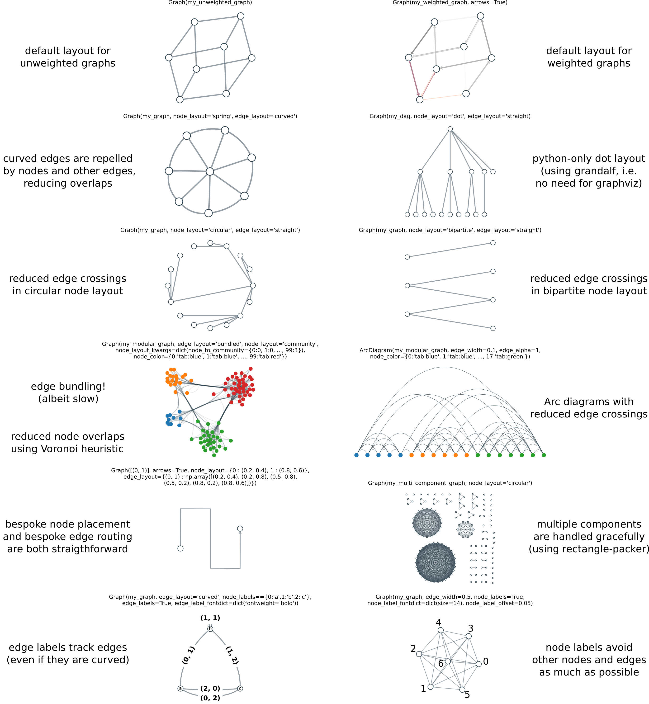

# Statement of need

The empirical study and scholarly analysis of networks has increased manyfold in recent decades, fuelled by the new prominence of network structures in our lives (the web, social networks, artificial neural networks, ecological networks, etc.) and the data available on them. While there are several comprehensive python libraries for network analysis such as networkx [@Hagberg:2008], igraph [@Csardi:2006], and graph-tool [@Peixoto:2014], their inbuilt visualisation capabilities lag behind specialised software solutions such as Graphviz [@Ellson:2002], Cytoscape [@Shannon:2003], or Gephi [@Bastian:2009]. However, although python bindings for these applications exist in the form of PyGraphviz, py4cytoscape, and GephiStreamer, respectively, their outputs are not manipulable python objects, which restricts customisation, limits their extensibility, and prevents a seamless integration within a wider python application.

# Summary

Netgraph is a python library that aims to complement the existing network analysis libraries with publication quality visualisations within the python ecosystem. To facilitate a seamless integration, netgraph supports a variety of input formats, including networkx, igraph, and graph-tool Graph objects. Netgraph implements numerous node layout algorithms and several edge routing routines. Uniquely among python alternatives, it handles networks with multiple components gracefully (which otherwise break most node layout routines), and it post-processes the output of the node layout and edge routing algorithms with several heuristics to increase the interpretability of the visualisation (reduction of overlaps between nodes, edges, and labels; edge crossing minimisation and edge unbundling where applicable). The highly customisable plots are created using matplotlib [@Hunter:2007], a popular python plotting library, and the resulting matplotlib objects are exposed in an easily queryable format such that they can be further manipulated and/or animated using standard matplotlib syntax. The visualisations can also be altered interactively: nodes and edges can be added on-the-fly through hotkeys, positioned using the mouse, and labelled through standard text-entry.

Netgraph is licensed under the General Public License version 3 (GPLv3). The repository is hosted on github, and distributed via PyPI and conda-forge. It includes an extensive automated test suite that can be executed using pytest. The comprehensive documentation -- including a complete API reference as well as numerous examples and tutorials -- is hosted on ReadTheDocs. Netgraph has been in continuous development since 2016, and accrued 120 000 LOC in 700+ commits by the author as well as five other contributors. At the time of writing, PyPI reports 140 000 downloads. On Github, the repository has 450+ stars, and is used by 50+ other packages.

# Figures

{width=90%}

# Acknowledgements

We thank github users adleris, Allan L. R. Hansen, chenghuzi, Hamed Mohammadpour, and Pablo for contributing various bug fixes.

# References
