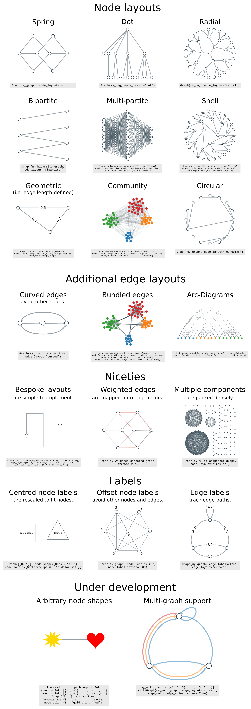

# Statement of need

The empirical study and scholarly analysis of networks has increased manyfold in recent decades, fuelled by the new prominence of network structures in our lives (the web, social networks, artificial neural networks, ecological networks, etc.) and the data available on them. While there are several comprehensive python libraries for network analysis such as networkx `[@hagberg:2008]`, igraph `[@csardi:2006]`, and graph-tool `[@peixoto:2014]`, their visualisation capabilities are rudimentary and lag behind specialised software solutions such as graphviz `[@ellson:2002]`, cytoscape `[@shannon:2003]`, or gephi `[@bastian:2009]`. However, these specialised tools each require their own specialised syntax, and as they are not written in python, it is difficult to incorporate them within a wider python data analysis pipeline or application.

# Summary

Netgraph is a python library that aims to complement the existing network analysis libraries to facilitate the creation of publication quality visualisations of networks within the python ecosystem. To facilitate seamless integration with other network analysis libraries, netgraph supports a variety of input formats, including networkx, igraph, and graph-tool Graph objects. Netgraph implements a variety of node layout algorithms (Fruchterman-Reingold/"spring", Sugiyama/"dot", circular, bi- and multi-partite, shell, radial, community, and edge-length defined) and edge routing routines (straight, curved, and bundled). Uniquely among python alternatives, it post-processes the output of the node layout and edge routing algorithms using several heuristics to increase the interpretability of the visualisation (removal of node-node overlaps, reduction of node-edge overlaps, reduction of label-node/label-edge overlaps, edge crossing minimisation, and edge unbundling). The highly customisable plots are created using matplotlib `[@hunter:2007]`, a popular python plotting library, and the resulting matplotlib objects are exposed in an easily queryable format such that they can be further manipulated using standard matplotlib syntax. The visualisations can also be altered interactively: nodes and edges can be added on-the-fly, and (re-)positioned using the mouse, and both can also be (re-)labelled through standard text-entry.

Netgraph is licensed under the General Public License version 3 (GPLv3). The repository is hosted on github, and distributed via PyPI and conda. It includes an extensive automated test suite that can be executed using pytest. A comprehensive documentation -- including a complete API reference as well as numerous examples and tutorials -- is hosted on ReadTheDocs. Netgraph has been in continuous development since 2016, and accrued 120 000 LOC in 700+ commits by the author as well as five other contributors. At the time of writing, PIPy reports 135 000 downloads. On Github, the repository has 450+ stars, and is used by 50 other packages.

# Examples

{width=90%}

# Acknowledgements

We thank github users adleris, Allan L. R. Hansen, chenghuzi, Hamed Mohammadpour, and Pablo for contributing various bug fixes.
