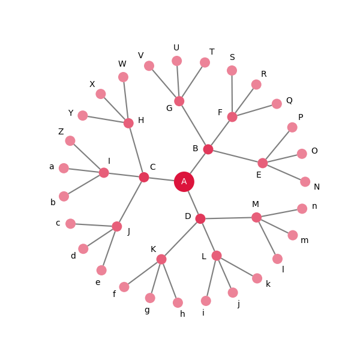

# Statement of need

The empirical study and scholarly analysis of networks has increased manyfold in recent decades, fuelled by the new prominence of network structures in our lives (the web, social networks, artificial neural networks, ecological networks, etc.) and the data available on them. While there are several comprehensive Python libraries for network analysis such as NetworkX [@Hagberg:2008], igraph [@Csardi:2006], and graph-tool [@Peixoto:2014], their inbuilt visualisation capabilities lag behind specialised software solutions such as Graphviz [@Ellson:2002], Cytoscape [@Shannon:2003], or Gephi [@Bastian:2009]. However, although Python bindings for these applications exist in the form of PyGraphviz, py4cytoscape, and GephiStreamer, respectively, their outputs are not manipulable Python objects, which restricts customisation, limits their extensibility, and prevents a seamless integration within a wider Python application.

# Summary

Netgraph is a Python library that aims to complement the existing network analysis libraries with publication quality visualisations within the Python ecosystem. To facilitate a seamless integration, Netgraph supports a variety of input formats, including NetworkX, igraph, and graph-tool Graph objects. At the time of writing, Netgraph provides the following node layout algorithms:

- the Fruchterman-Reingold algorithm a.k.a. the "spring" layout,
- the Sugiyama algorithm a.k.a. the "dot" layout for directed, acyclic graphs,
- a radial tree layout for directed, acyclic graphs,
- a circular node layout (with optional edge crossing reduction),
- a bipartite node layout for bipartite graphs (with optional edge crossing reduction),
- a layered node layout for multipartite graphs (with optional edge crossing reduction),
- a shell layout for multipartite graphs (with optional edge crossing reduction),
- a community node layout for modular graphs, and
- a "geometric" node layout for graphs with defined edge lengths but unknown node positions.

Additionally, links or edges between the nodes can be straight, curved (avoiding collisions with other nodes and edges), or bundled.
However, new layout routines are added regularly to Netgraph; for an up-to-date list, consult the online documentation [here](https://netgraph.readthedocs.io/en/latest/node_layout.html).

Uniquely among Python alternatives, Netgraph handles networks with multiple components gracefully (which otherwise break most node layout routines), and it post-processes the output of the node layout and edge routing algorithms with several heuristics to increase the interpretability of the visualisation (reduction of overlaps between nodes, edges, and labels; edge crossing minimisation and edge unbundling where applicable). The highly customisable plots are created using Matplotlib [@Hunter:2007], a popular Python plotting library, and the resulting Matplotlib objects are exposed in an easily queryable format such that they can be further manipulated and/or animated using standard Matplotlib syntax. The visualisations can also be altered interactively: nodes and edges can be added on-the-fly through hotkeys, positioned using the mouse, and labelled through standard text-entry.

Netgraph is licensed under the General Public License version 3 (GPLv3). The repository is hosted on [GitHub](https://github.com/paulbrodersen/netgraph), and distributed via PyPI and conda-forge. It includes an extensive automated test suite that can be executed using pytest. The comprehensive documentation -- including a complete API reference as well as numerous examples and tutorials -- is hosted on [ReadTheDocs](https://netgraph.readthedocs.io).

# Figures

{width=90%}

\pagebreak

# A Basic Example

The following script shows a minimum, working example. The graph structure is defined by an edge list, and the visualisation is created using (mostly) default parameters.

```python
import matplotlib.pyplot as plt

from netgraph import Graph

triangle = [
    (0, 1),
    (1, 2),
    (2, 0),
    (1, 1), # self-loop
]
Graph(
    triangle,
    node_labels=True,
    arrows=True,
)
plt.show()
```

{width=50%}

# Interoperability & Customizability

Netgraph can be easily integrated into existing network analysis workflows as it accepts a variety of graph structures. The example below uses a NetworkX `Graph` object, but igraph and graph-tool objects are also valid inputs, as are plain edge lists and full-rank adjacency matrices. The output visualizations are created using Matplotlib and can hence form subplots in larger Matplotlib figures.

Each visualization can be customized in various ways. Most parameters can be set using a scalar or string. In this case, the value is applied to all relevant artists. To style each artist differently, supply a dictionary instead. Furthermore, node and edge artists are derived from `matplotlib.patches.PathPatch`; node and edge labels are `matplotlib.text.Text` instances. Hence all node artists, edge artists, and labels can be manipulated using standard matplotlib syntax after the initial draw.

``` python
import numpy as np
import matplotlib.pyplot as plt
import networkx as nx

from netgraph import Graph

# initialize the figure
fig, ax = plt.subplots(figsize=(6,6))

# initialize the graph structure
balanced_tree = nx.balanced_tree(3, 3)

# initialize the visualization
g = Graph(
    balanced_tree,
    node_layout='radial',
    edge_layout='straight',
    node_color='crimson',
    node_size={node : 4 if node == 0 else 2 for node in balanced_tree},
    node_edge_width=0,
    edge_color='black',
    edge_width=0.5,
    node_labels=dict(
        zip(balanced_tree, 'ABCDEFGHIJKLMNOPQRSTUVWXYZabcdefghijklmnopqrstuvwxyz')
    ),
    node_label_offset=0.05,
    node_label_fontdict=dict(fontsize=10),
    ax=ax,
)

# center the label of the root node on the corresponding node artist and make it white.
root = 0 # NetworkX graph generator convention
center = g.node_positions[root]
g.node_label_artists[root].set_position(center)
g.node_label_artists[root].set_color('white')

# decrease the node artist alpha parameter from the root to the leaves or the graph:
for node in balanced_tree:
    distance = np.linalg.norm(center - g.node_positions[node])
    g.node_artists[node].set_alpha(1 - distance)

# Redraw figure to display changes
fig.canvas.draw()
```

{width=50%}

# Acknowledgements

We thank GitHub users adleris, Allan L. R. Hansen, chenghuzi, Hamed Mohammadpour, and Pablo for contributing various bug fixes.

# References
